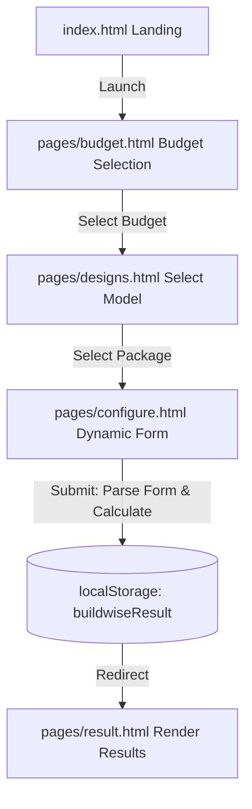

# BuildWise — System Architecture & Integration Guide

BuildWise is an intelligent, frontend-driven construction estimation and architectural optimization platform. The system allows users to select a architectural model, configure materials, toggle structural preferences, and estimate base construction details (area, budget allocations, materials catalog, and build timelines).

This document serves as the developer documentation and backend integration blueprint for the entire platform.

---

## 1. Directory & File Structure

The project follows a modular frontend structure that segregates styling, reusable components, dynamic forms, page routing, and business logic:

```
ssytem/
│
├── index.html                 # Main entry point (Landing Page)
├── styles.css                 # Global CSS stylesheet (design system, layouts, skeletons)
├── DESIGN_SYSTEM.md           # Documentation for tokens, variables, and typography
│
├── assets/                    # Image assets, logo, and architectural references
│   ├── logo/                  # Brand assets (logo.png)
│   └── house-type/            # Standard catalog previews for models
│
├── components/                # Modular Custom Web Components (JS)
│   ├── navbar.js              # Header navigation (<bw-navbar>)
│   ├── footer.js              # Footer brand & legal links (<bw-footer>)
│   └── progress.js            # Stepper component (<bw-progress>)
│
├── configs/                   # Form schemas for different house models (JS)
│   ├── loft.config.js         # Configuration markup for Loft Style
│   ├── two-storey.config.js   # Configuration markup for Two Storey
│   ├── half-metal.config.js   # Config for Bungalow (Half Metal)
│   ├── half-amakan.config.js  # Config for Bungalow (Half Amakan)
│   └── chb.config.js          # Config for Bungalow (Concrete Hollow Block)
│
├── pages/                     # Application views (HTML)
│   ├── budget.html            # Phase 1: Target Budget Selection
│   ├── designs.html           # Phase 1b: House Style Selection
│   ├── configure.html         # Phase 2: Dynamic choice configurations
│   └── result.html            # Phase 3: Estimate summary & backend shell
│
└── scripts/                   # Shared and view-specific scripts (JS)
    ├── house-data.js          # Unified house type catalog & URL readers
    ├── utils.js               # Common DOM manipulation utilities
    ├── configure.js           # Form parsing, area calculation, & localStorage writer
    └── result.js              # Result calculations, layout rendering, & API bindings
```

---

## 2. Dynamic Component Framework

BuildWise uses custom web components to keep the HTML dry and layout consistent:

### Navbar (`components/navbar.js`)
* **Element:** `<bw-navbar>`
* **Attributes:** `base-path` (optional, e.g., `../`). Used to resolve relative links (like `index.html` or logo images) when loaded from inside subfolders.
* **Responsibilities:** Renders sticky header navigation.

### Footer (`components/footer.js`)
* **Element:** `<bw-footer>`
* **Attributes:** `base-path` (optional, e.g., `../`). Resolves asset paths dynamically.
* **Responsibilities:** Renders legal disclaimers, support channels, and footer branding.

### Progress Stepper (`components/progress.js`)
* **Element:** `<bw-progress>`
* **Attributes:** `current` (`1` = Design, `2` = Customize, `3` = Results).
* **Responsibilities:** Renders a step indicator showing progress through the builder wizard.

---

## 3. Dynamic Configuration System

Dynamic forms avoid hardcoded markup in `configure.html`.

1. When a user clicks a house type, they are redirected to `configure.html?type=<typeKey>`.
2. `scripts/configure.js` reads the URL parameter using `currentTypeKey()` (from `scripts/house-data.js`).
3. It resolves the configuration schema from `window.BuildWiseFormConfigs[typeKey]` (loaded from files in `configs/`).
4. The script creates a form element, attaches the `formHtml` template literal, wires up event listeners, and mounts it into the `#configFormMount` div.

---

## 4. Logical Workflow & State Management

BuildWise manages state client-side using `localStorage`:



### Form Submission (`scripts/configure.js` -> `wireFormSubmit`)
When submitting a customization form:
1. Strips formatted commas from budget inputs (e.g. `1,500,000` -> `1500000`).
2. Calculates cumulative area: `groundArea` + `secondFloorArea` + `mezzanineArea`.
3. Determines family classification based on bedroom count.
4. Serializes input checkboxes and dropdowns into an `options` map.
5. Saves a JSON record under `localStorage.getItem("buildwiseResult")`.
6. Redirects user to `result.html?type=<typeKey>`.

---

## 5. Result Page & Future Integration Contract

`pages/result.html` contains placeholders and shimmer skeleton states. In `scripts/result.js`, we expose `window.BuildWiseResult` to serve as the contract for your future AI render models and cost estimation engine.

### Integration Hooks API

Once your backend generates data, call these functions to populate the result page frontend:

#### 1. Image Generation Integration (`setGeneratedImages`)
Injects AI renders into the exterior and floor plan boxes.

```javascript
window.BuildWiseResult.setGeneratedImages({
  houseRenderUrl: "https://your-backend.com/images/generated-render.jpeg",
  floorPlanUrl:   "https://your-backend.com/images/generated-floorplan.png"
});
```

#### 2. Cost Prediction Timeline (`writeConstructionPhases`)
Presents a phased timeline of days and workers. Calling this automatically hides the "Awaiting estimation" timeline placeholder.

```javascript
window.BuildWiseResult.writeConstructionPhases([
  { name: "Site Clearing & Excavation", days: 3,  workers: 4 },
  { name: "Foundation & Slab Pouring",  days: 10, workers: 6 },
  { name: "Structural Framing & CHB",   days: 15, workers: 8 },
  { name: "Roofing Installation",       days: 5,  workers: 5 },
  { name: "Electrical & Plumbing Rough",days: 8,  workers: 3 },
  { name: "Finishing & Interior Trim",  days: 12, workers: 4 }
]);
```

#### 3. Materials Catalog Calculation (`writeMaterialsTable`)
Presents a categorized table breakdown of all required building items. Calling this automatically hides the materials placeholder skeleton.

```javascript
window.BuildWiseResult.writeMaterialsTable([
  {
    category: "Foundation & Framing",
    items: [
      { name: "Portland Cement (40kg)", qty: 85,  unit: "bags",  unitCost: 280,  total: 23800 },
      { name: "Deformed Rebar (10mm)",   qty: 70,  unit: "pcs",   unitCost: 320,  total: 22400 },
      { name: "Gravel (3/4\")",           qty: 12,  unit: "cu.m",  unitCost: 1100, total: 13200 }
    ]
  },
  {
    category: "Walling & Masonry",
    items: [
      { name: "Concrete Hollow Block (4\")", qty: 950, unit: "pcs",  unitCost: 15,   total: 14250 },
      { name: "Washed Sand",                 qty: 14,  unit: "cu.m",  unitCost: 900,  total: 12600 }
    ]
  }
]);
```

---

## 6. Styling & CSS Architecture (`styles.css`)

The styling is custom vanilla CSS written with modern variables, organized into 13 logical regions:

1. **TOKENS & RESET:** Declares global theme tokens (`--bg`, `--surface`, `--primary`, `--accent`) and standard resets.
2. **BASE STYLES:** Standard layout definitions for body, anchors, and basic grid wrappers.
3. **WEB COMPONENT (NAVBAR):** Styles the custom header elements.
4. **LANDING PAGE:** Backdrop grid layouts, hero graphics, and typography for the root entrance page.
5. **BUTTON UTILITIES:** General-purpose buttons.
6. **BUILDER PAGE CORE LAYOUT:** Padding and standard viewport wrapper styles.
7. **WEB COMPONENT (PROGRESS STEPPER):** Renders the custom progress indicators.
8. **ARCHITECTURAL MODELS:** Visual styles for selection cards.
9. **LEGACY CONFIGURATION FORM:** Styling elements for standard fields.
10. **WEB COMPONENT (FOOTER):** Styles the layout grid of the footer.
11. **FRIENDLY BUILDER & CONFIG:** Styles modern configuration inputs, switches, and sliders.
12. **FRIENDLY STATS & RESULT GRID:** Layout variables for cost charts, responsive summary cards, and stats rows.
13. **RESULT PAGE SHELL ELEMENTS:** CSS rules for skeleton shimmers, timeline phases, and materials lists.
